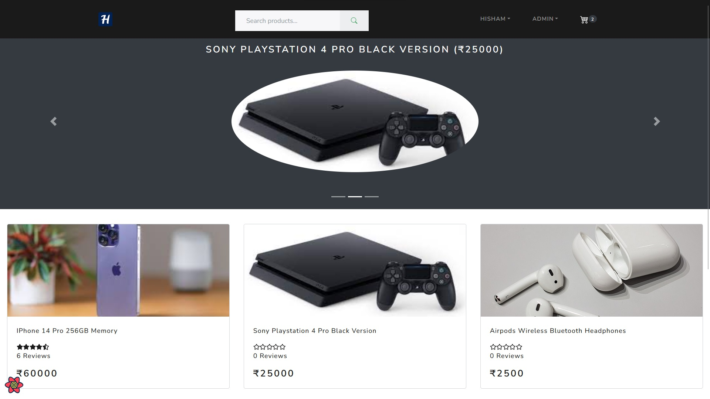
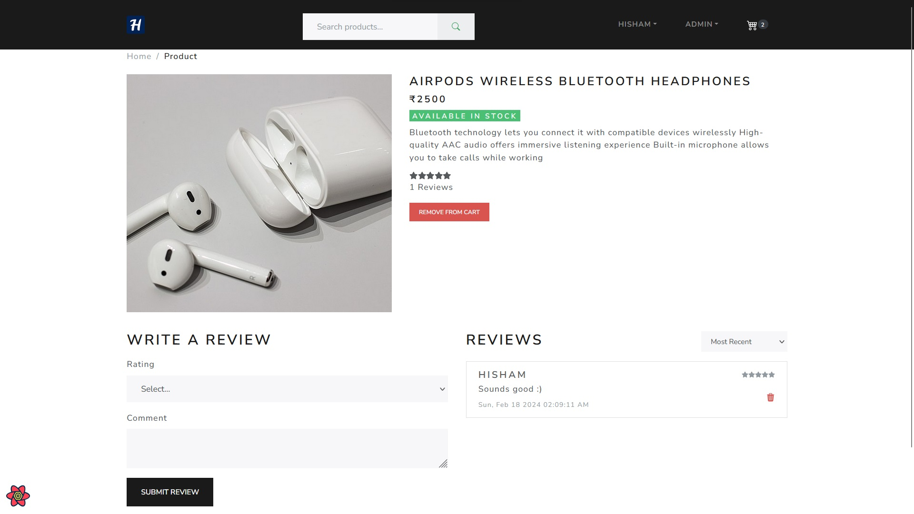

# 🛒 H-Shop — Online Shopping Web App (Client)

[](https://h-shop.onrender.com/)
[](https://react.dev/)
[](https://www.typescriptlang.org/)
[](https://redux.js.org/)
[](https://stripe.com/)
[](https://getbootstrap.com/)

**H-Shop** is a **full-featured online shopping web application** that allows customers to **browse products, place orders, make payments, and track order status**.  
Admins can **manage products, monitor sales, and view dashboard analytics**.  
Payments are securely integrated using **Stripe**. The application is deployed on **Render**.

> ⚠️ **Note**: This repository contains the **client-side** code for H-Shop.  
> For the **server-side** API, check [H-Shop Server](https://github.com/mohamedhisham95/h-shop-server).

---

## 🔗 Live Demo

🚀 **Try the app here** → [https://h-shop.onrender.com/](https://h-shop.onrender.com/)

---

## ✨ Features

### **For Customers**

- 🛍️ **Product Browsing** — Explore a wide range of products.
- 💳 **Secure Payments** — Integrated with [Stripe](https://stripe.com/) for safe transactions.
- 📦 **Order Tracking** — Monitor the status of your orders in real-time.
- 👤 **Profile Management** — Update personal details easily.
- 🛒 **Shopping Cart** — Add, remove, and manage items effortlessly.

### **For Admins**

- ➕ **Product Management** — Add, edit, or delete products.
- 📊 **Sales Dashboard** — Visualize overall stats using interactive charts.
- 📑 **Order Management** — View and track all customer orders.

---

## 🖼️ Preview




---

## 🛠️ Tech Stack (Client)

- **Framework**: [React](https://react.dev/) (CRA)
- **Language**: [TypeScript](https://www.typescriptlang.org/)
- **Styling**: [Bootstrap](https://getbootstrap.com/)
- **State Management**: [Redux](https://redux.js.org/)
- **Payment Gateway**: [Stripe](https://stripe.com/)
- **Data Fetching**: REST APIs from the [H-Shop Server](https://github.com/mohamedhisham95/h-shop-server)
- **Deployment**: [Render](https://render.com/)

---

## 📌 Project Purpose

This project was developed as part of a Udemy full-stack course to learn Node.js, Express, MongoDB, and RESTful APIs.

After completing the course, I extended the app by adding:

- Cloudinary for image hosting.
- Admin dashboard with analytics.
- Enhanced order management features.

---

## 🚀 Getting Started

### 1. Clone the Repository

```bash
git clone https://github.com/mohamedhisham95/h-shop-client.git
cd h-shop-client
```

### 2. Prefered Node Version

```
18.20.8
```

### 3. Install Dependencies

```
npm install
```

### 4. Set Up Environment Variables

Create a .env file in the root directory:

```
REACT_APP_SERVER_URL=server_base_url/api
REACT_APP_STRIPE_KEY=stripe_key
```

### 5. Run the Development Server

```
npm start
```

Built with ❤️ using React, TypeScript, Redux, Bootstrap, and Stripe
